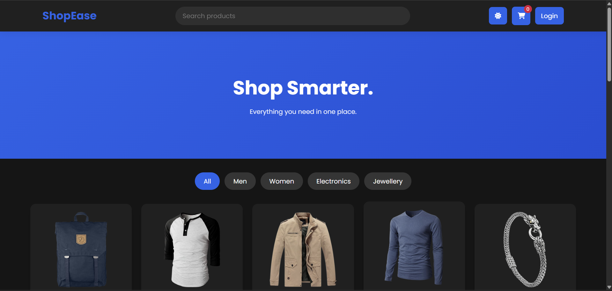
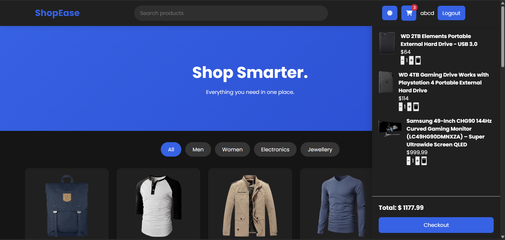
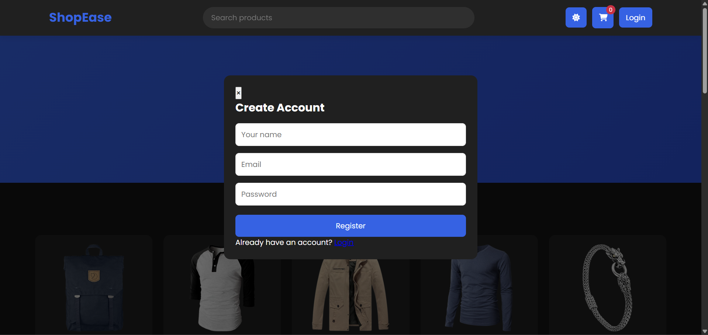

# ShopEase 🛒

ShopEase is a simple e-commerce website built using HTML, CSS, and JavaScript.

I created this project to practice working with APIs, DOM manipulation, user authentication, and managing data using JavaScript.

The website uses the Fake Store API to display products and includes features like searching, filtering, cart management, login/register system, and dark mode.

## Features

- Product listing from API
- Search products
- Filter products by category
- View product details
- Add products to cart
- Increase or decrease item quantity
- Remove items from cart
- User registration and login
- User-specific cart storage
- Dark mode support
- Responsive design
- Checkout simulation

## Technologies Used

- HTML5
- CSS3
- JavaScript (ES6)
- Fake Store API
- LocalStorage
- Font Awesome

## How to Run

1. Clone this repository:

```bash
git clone your-repository-link
```

2. Open the project folder.

3. Open `index.html` in your browser.

No installation or setup is required.

## Project Structure

```
ShopEase/
│
├── index.html
├── style.css
├── app.js
├── README.md
│
└── SS/
    ├── home.png
    ├── cart.png
    └── login.png
```

## Screenshots

### Homepage



### Shopping Cart



### Login



## Notes

This is a frontend-only project.

The login and registration system is created for demonstration purposes using LocalStorage. It does not use a real database or backend authentication.

## Future Improvements

Some features I would like to add in the future:

- Real authentication using Firebase
- Product sorting
- Wishlist functionality
- Real payment integration
- Backend support
- Order history

## Author

Built as a frontend development project while learning and improving JavaScript skills.
